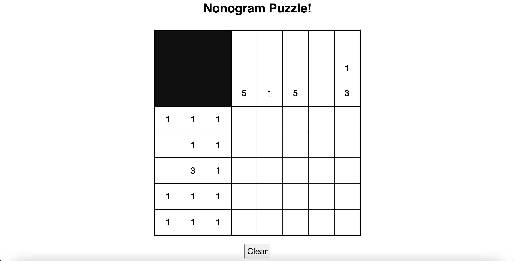
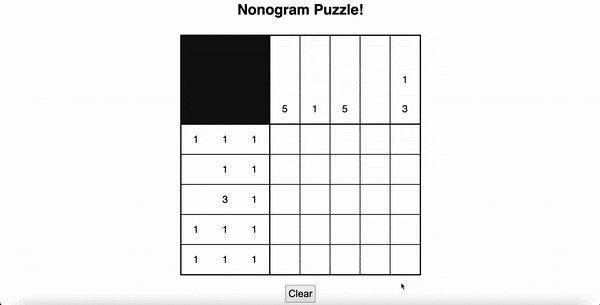

# nonogram-puzzle

You'll be making a nonogram puzzle (Hanjie, Number Grid, Pi-Cross, etc) and allow the user to play the game by filling, unfilling, or clearing tiles of a nonogram puzzle. You do not need to know how these puzzles work to complete the project.

<p>
  
</p>

## Objective

Complete the UI of a nonogram puzzle. Practice DOM manipulation using JavaScript by completing several functions.

We have provided the HTML (```project.html```) and CSS (```project.css```) that you will need for this project. You will be writing JavaScript code in a file called ```project.js``` and make it possible to play the puzzle.

## Prerequisites

To complete this project, students should have the following:
* Basic understanding of JS (arrays, objects, functions, if statements, this)

## Your Challenge

### Getting started

1. Download this project from GitHub.

2. Open the JavaScript file (```project.js```). You will be writing JavaScript code here.

3. Open ```project.html``` on your web browser to understand what you will be adding functionality to.

### Part I: Make an alert pop up when a user clicks a tile

If a user clicks on any tile, an alert pops up with a message. Complete the function ```setUpTiles``` by:

1. Selecting all tiles in the grid with the class ```.box``` by using ```document.querySelectorAll```. Create a reference to all the tiles in a variable named ```tiles```. ```tiles``` will hold and array of all the elements with the class ```.box```.

2. Inside the for loop, 

3. Create a variable named ```tile``` and set it to a single element in the tiles array. You can use the variable ```i``` as the index.

4. If any tile is clicked on, an alert pops up with the message ***"You clicked a tile!"***. Use the ```alert``` function. You can do this by attaching a ```click``` addEventListener to the tile. In the response function, use the ```alert``` function.

<p>
  
</p>

### Part II: Make a single tile turn black when its clicked

If a user clicks on any tile, it will turn black and become filled. You can complete this by updating and completing two functions:

1. Complete the function ```changeBoxMark``` so that a single tile is filled in when a user clicks on it. There is a class, ```filled```, that handles the styling for you in the ```css``` file. Add the following line: ```this.classList.add()``` then fill in the parantheses with ```filled``` class.

2. Update the function ```setUpTiles``` so that the ```changeBoxMark``` function is called whenever a single tile is clicked on. You should also remove the alert pop up in ```setUpTiles``` function.

<p>
  
</p>

### Part III: Implement fill toggling

If a user clicks on a white tile, it will turn black (or become filled). If a user clicks a black tile, it will turn white (or become unfilled). Modify your ```changeBoxMark``` function so that toggling between unfilled and filled tiles is possible.

1. You will need to implement ```if-else``` statements in the ```changeBoxMark``` function to change black tiles to white tiles and vice versa. There is no "unfilled" class for the tiles. You can clear a filled tile by simply removing the ```.filled``` class.

2. Set up an ```if-else``` statement. To check if an element has the class ```filled```, use the following line: ```this.classList.conatins("filled")```

3. To remove the ```filled``` class from an element, use ```this.classList.remove("filled")```

4. To add the ```filled``` class from an element, use ```this.classList.add("filled")```

<p>
  
</p>

### Part IV: Add functionality to the "Clear" button

When the "Clear" button is clicked, the user will be asked to confirm their choice and if the choice is "OK" all filled tiles will be unfilled.

1. Create an if statement confirming if the user wants to clear the puzzle. Add a ```confirm``` message in the condition so that the user has a second chance to decide if they want to clear their tiles. The message should say ***"Are you sure you want to clear the puzzle?"***. The tiles will clear only if the users confirms ```OK```.

2. Inside the if-statment select every tile and remove the class ```.filled```

3. Select all tiles in the grid with the class ```.box``` by using ```document.querySelectorAll```. Create a reference to all the tiles in a variable named ```tiles```. ```tiles``` will hold an array of all the elements with the class ```.box```.

4. Inside the for loop, 

5. Remove the ```filled``` class from each tile in the ```tiles``` array. To
remove the ```filled``` class from an element, use ```yourArray[i].classList.remove("filled")```

6. Inside the ```window.onload``` function, get a reference to the element with the id ```clear```. Do this below the ```setUpTiles()``` function call.

7. Then add a click event listener to call the ```clearPuzzle()``` function.

<p>
  
</p>
